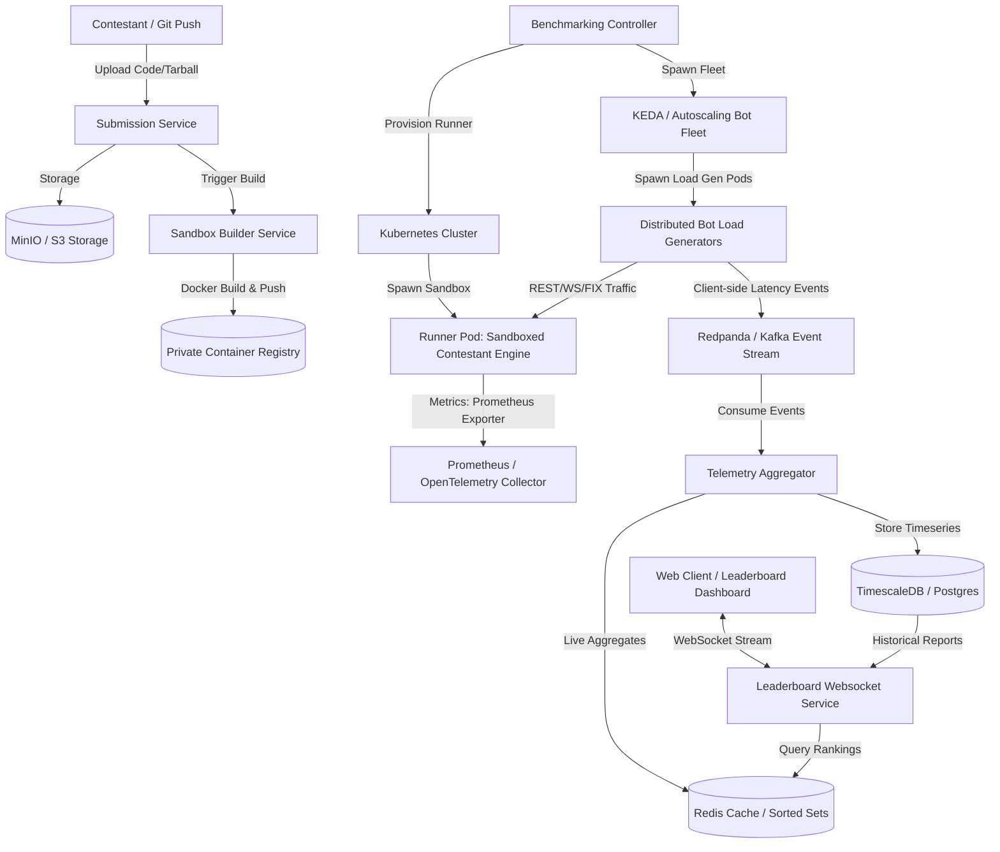

# Distributed Benchmarking & Hosting Platform - Engineering Roadmap & Implementation Plan

This document details the production-grade engineering roadmap, architectural decisions, and phase-wise execution plan for building the **Distributed Benchmarking & Hosting Platform for Trading Engines** for the IICPC Summer Hackathon 2026.

## High-Level System Architecture (Final Target State)

The following Mermaid diagram outlines the end-to-end data and control flow of the complete platform at Phase 8:



---

## Phase-by-Phase Roadmap

### PHASE 1: Basic Matching Engine & Local APIs

#### Objective
Establish a fully functional, deterministic, in-memory limit order book (LOB) with basic REST/WebSocket APIs to allow trading.

#### Engineering Goals
- Sub-microsecond matching latency for in-memory operations.
- Deterministic state machine where order execution sequence is guaranteed by price-time priority.
- Core memory safety and zero-allocation critical path where possible.

#### Features to Implement
- Limit and Market orders (Buy/Sell).
- Order cancellation.
- L1 (best bid/ask) and L2 (full book depth) data structures.
- REST endpoints for order placement and cancellation.
- WebSocket stream for real-time market updates and execution reports.

#### Folder Structure
```
├── cmd/
│   └── matching-engine/
│       └── main.go
├── pkg/
│   ├── orderbook/
│   │   ├── orderbook.go        # LOB state management and matching logic
│   │   ├── limit.go            # Price level bucket (doubly-linked list of orders)
│   │   └── order.go            # Order structs and definitions
│   └── api/
│       ├── rest.go             # REST API handlers
│       └── websocket.go        # WebSocket connection manager & hub
```

#### Suggested Tech Stack
- **Language**: Go 1.22+ (No third-party GC-heavy packages in matching critical path).
- **Web Framework**: Standard library `net/http` (with `http.NewServeMux`) or `gin` for REST.
- **WebSockets**: `gorilla/websocket` or `nhooyr.io/websocket` for low-overhead connections.

#### APIs Required
- `POST /api/v1/orders` - Place an order (Limit/Market).
- `DELETE /api/v1/orders/{id}` - Cancel an order.
- `GET /api/v1/orderbook` - Fetch snapshot of L2 book.
- `GET /ws/market-data` - WebSocket feed for order execution reports and price updates.

#### Database Schema
No database is used in Phase 1 (100% in-memory matching). The state is kept volatile to maximize raw throughput.

#### Kubernetes Components
Not applicable for Phase 1. Development is local.

#### Messaging/Event Flow
```
Client -> [HTTP POST] -> REST Handler -> [Go Channels] -> Order Book Thread -> Match Executed -> Broadcast WS
```
*Note: A single-threaded event loop handles orderbook updates to avoid mutex contention on the LOB data structures.*

#### Metrics to Track
- In-memory matching latency (nanoseconds/microseconds).
- Total orders matched/second (Throughput).
- Active connection count.

#### Security Concerns
- API rate-limiting to prevent local HTTP socket exhaustion.
- Invalid input validation (e.g., negative prices, zero quantities) to prevent panics inside the matching loop.

#### Scaling Concerns
- **Single-Thread Bottleneck**: The matching engine must run on a single thread to guarantee deterministic execution without locks. Max throughput is bound by single-core speed.
- **WebSocket Serialization**: Serializing JSON payloads to WebSockets can dominate CPU usage.

#### Deliverables
- A compiled Go matching engine binary.
- Benchmark tests proving $>1,000,000$ matches/sec on local hardware.

#### Git Commits/Milestones
- `feat(engine): implement core doubly-linked list orderbook and price-time matching`
- `feat(api): implement REST order placement and WebSocket market data broadcast`
- `perf(engine): add Go microbenchmarks for matching latency`

#### Testing Strategy
- Unit tests validating matching rules: limit fill, market fill, partial fill, self-matching checks, cancellation behavior.
- Go benchmark tests (`go test -bench=. -benchmem`) to assert allocations and nanoseconds per operation.

#### Common Pitfalls
- **Using Mutexes per Price Level**: Causes lock contention. Keep the orderbook single-threaded and feed it through a buffered lock-free Go channel.
- **Float64 for Prices**: Leads to floating-point rounding errors. Always represent prices and quantities as integers (e.g., micro-units or fixed-point arithmetic, e.g., $1.50 \rightarrow 15000$).

#### Future Extensibility
- Design the `OrderBook` as a Go interface to support pluggable matching strategies (e.g., Pro-Rata or Auction matching).

---

### PHASE 2: Concurrent Distributed Load Generator

#### Objective
Generate heavy, concurrent market traffic simulating thousands of high-frequency trading (HFT) bots to benchmark Phase 1 APIs.

#### Engineering Goals
- Concurrent traffic simulation with precise control over Transaction-Per-Second (TPS) targets.
- Horizontal scaling capability for load generator workers.
- Out-of-band RTT (Round Trip Time) latency measurement.

#### Features to Implement
- Simulated bot profiles: Market Makers (post bid-ask spreads), Noise Traders (random market orders), Arbitrageurs.
- Target TPS configuration.
- Client-side latency tracking (timestamp logged immediately before send vs timestamp when execution report is received over WS).

#### Folder Structure
```
├── cmd/
│   └── load-generator/
│       └── main.go
├── pkg/
│   └── loadgen/
│       ├── bot.go              # Bot interface and behavior engine
│       ├── profiles.go         # Market maker and noise trader implementations
│       └── orchestrator.go     # Coordinator for scaling bot routines
```

#### Suggested Tech Stack
- **Language**: Go.
- **Concurrency**: Goroutines, channels, and `sync.WaitGroup` to spawn and manage bot routines.
- **Client**: Tuned Go standard `net/http` client (keep-alive, idle connections tuned).

#### APIs Required
None. This service acts exclusively as an API client to the matching engine.

#### Database Schema
No database. Metrics are printed to console / logged locally for analysis.

#### Kubernetes Components
Not applicable yet. Run via docker-compose locally.

#### Messaging/Event Flow
```
Load Gen Master -> (Go Channels) -> Bot Workers -> [HTTP Requests] -> Matching Engine
       ^                                                                |
       └--------- [WS Execution Reports] <-------------------------------┘
```

#### Metrics to Track
- Target vs. Actual TPS generated.
- Round-Trip Time (RTT) latency (p50, p90, p99) measured from client side.
- HTTP Request error rate.

#### Security Concerns
- Distributed denial of service (DDoS) characteristics. Ensure testing is confined to private networks.

#### Scaling Concerns
- **Client OS Port Limits**: Running out of ephemeral ports on the host running the load generator. Tune `TCP_NODELAY` and reuse TCP connections.
- **GC pauses in Go load generator**: Garbage collection in the load generator itself can skew the measured RTT latency. Use struct pools (`sync.Pool`).

#### Deliverables
- Executable load-generation tool configurable via YAML/environment variables.
- Run report demonstrating $>50,000$ TPS sustained traffic.

#### Git Commits/Milestones
- `feat(loadgen): implement concurrent bot generator with configurable tick rates`
- `feat(loadgen): implement market maker and noise trader behaviors`
- `feat(loadgen): add client-side RTT latency metrics reporting`

#### Testing Strategy
- Integration testing: Run matching engine and load generator together locally. Verify that the load generator does not drop connections under sustained 10,000 TPS.

#### Common Pitfalls
- **Coordinated Omission**: Measuring latency by queuing requests locally and using the queue exit time. The stopwatch must start *before* queueing or network transmission to capture actual delays.
- **Spawning one OS thread per bot**: Goroutines are cheap, but spawning millions will thrash the scheduler. Use a worker pool or control concurrency limits.

#### Future Extensibility
- Pluggable traffic patterns (Poisson distribution, historical market replay).

---

### PHASE 3: Metrics & Telemetry Pipeline

#### Objective
Ingest, aggregate, and store real-time telemetry from the matching engine and load generators to build historical reports and live analytics dashboards.

#### Engineering Goals
- Low-overhead telemetry collection.
- Clean separation between transactional code path and metrics collection path.
- Sub-millisecond histogram accuracy (high-resolution timer tracing).

#### Features to Implement
- Metrics collection using OpenTelemetry and Prometheus client SDK.
- Time-series persistence of performance metrics.
- Grafana dashboard showing live latency percentiles, throughput, and error rates.

#### Folder Structure
```
├── cmd/
│   └── telemetry-aggregator/
│       └── main.go
├── deployments/
│   ├── prometheus/
│   │   └── prometheus.yml
│   └── grafana/
│       ├── provision.yml
│       └── dashboards/
│           └── trading_dashboard.json
├── pkg/
│   └── telemetry/
│       └── exporter.go         # OpenTelemetry setup and runtime metrics instrumentation
```

#### Suggested Tech Stack
- **Database**: PostgreSQL with **TimescaleDB extension** (for long-term metrics) + **Redis** (for real-time fast counters).
- **Collector**: Prometheus & OpenTelemetry Collector.
- **Visuals**: Grafana.

#### APIs Required
- `GET /metrics` - Prometheus metrics scraping endpoint exposed on matching engine and load generator.
- `GET /api/v1/analytics/runs` - Get historical benchmarking runs.

#### Database Schema
##### TimescaleDB schema (`benchmarking_runs` & `latencies`)
```sql
CREATE TABLE benchmarking_runs (
    run_id UUID PRIMARY KEY DEFAULT gen_random_uuid(),
    contestant_id VARCHAR(255) NOT NULL,
    started_at TIMESTAMPTZ NOT NULL,
    ended_at TIMESTAMPTZ,
    status VARCHAR(50) NOT NULL
);

CREATE TABLE order_latencies (
    time TIMESTAMPTZ NOT NULL,
    run_id UUID NOT NULL,
    latency_ns BIGINT NOT NULL,
    is_success BOOLEAN NOT NULL
);
SELECT create_hypertable('order_latencies', 'time');
```

#### Kubernetes Components
Not applicable. Docker Compose is used to orchestrate Engine, LoadGen, Prometheus, Grafana, TimescaleDB, and Redis.

#### Messaging/Event Flow
```
Matching Engine & LoadGen --> [Expose /metrics] <--- [Scrape] --- Prometheus
                                                                      |
Grafana <--- [Query] -------------------------------------------------┘
```

#### Metrics to Track
- Matching engine internal latencies (order queueing, matching loop execution, serialization).
- Prometheus metrics: `trading_orders_total`, `trading_matching_duration_seconds` (histogram).
- System metrics: CPU/Memory usage of the matching engine.

#### Security Concerns
- Do not expose the `/metrics` endpoint to the public internet. Ensure it is only accessible from the internal monitoring network.

#### Scaling Concerns
- **TimescaleDB Ingestion Rate**: If every order logs a row, TimescaleDB will be overwhelmed at 100k TPS.
- **Mitigation**: Pre-aggregate latencies on the client/engine using HDR Histograms (e.g., calculating p50/p90/p99 locally over 1-second windows) and write only the aggregated window summaries to the database.

#### Deliverables
- Instrumented Phase 1 & 2 binaries.
- Configured Prometheus and Grafana instances via Docker Compose.
- Live-updating dashboard plotting real-time latencies (p50, p90, p99).

#### Git Commits/Milestones
- `feat(telemetry): instrument matching engine and load generator with Prometheus client`
- `docker: add TimescaleDB, Prometheus, and Grafana to docker-compose`
- `infra(grafana): provision default dashboards for system performance and trading KPIs`

#### Testing Strategy
- Assert that scraping `/metrics` does not degrade matching engine performance by running a benchmark with and without telemetry enabled. Latency degradation should be $<5\%$.

#### Common Pitfalls
- **High-cardinality labels in Prometheus**: Do not use `order_id` or `user_id` as labels in Prometheus. This will explode memory usage and crash Prometheus. Use low-cardinality labels like `order_type` or `side`.

#### Future Extensibility
- Trace propagation across distributed workers using OpenTelemetry context propagation.

---

### PHASE 4: Contestant Submission System & Docker Sandboxing

#### Objective
Enable contestants to submit custom matching engine binaries/code, compile them safely, and execute them in secure, resource-constrained environments.

#### Engineering Goals
- Absolute isolation of contestant binaries to prevent remote code execution (RCE) on the host.
- Hardware resource bounding (CPU pinning, Memory limit).
- Automated build pipeline for multiple programming languages.

#### Features to Implement
- Submit engine code via Git URL or direct file upload.
- Secure building process using an isolated build container.
- Containerized runtime execution with dropped capabilities, read-only root filesystems, and strict resource allocations.

#### Folder Structure
```
├── cmd/
│   └── submission-service/
│       └── main.go
├── pkg/
│   ├── sandbox/
│   │   ├── docker.go           # Docker API wrapper for container management
│   │   └── builder.go          # Builder image engine
│   └── submission/
│       └── handler.go          # File upload & git checkout logic
├── build/
│   ├── builder-cpp.Dockerfile
│   ├── builder-go.Dockerfile
│   └── runner-base.Dockerfile  # Locked-down base image for running submissions
```

#### Suggested Tech Stack
- **Database**: PostgreSQL (stores contestant meta, runs, submission state).
- **Object Storage**: MinIO (local S3 equivalent) to store contestant files/binaries.
- **Container Runtime**: Docker Daemon accessed via Docker Go SDK.

#### APIs Required
- `POST /api/v1/submissions` - Upload engine code or submit Git repo.
- `GET /api/v1/submissions/{id}` - Fetch submission compilation and build status.
- `POST /api/v1/runs` - Trigger a benchmarking run for a specific submission.

#### Database Schema
```sql
CREATE TABLE submissions (
    id UUID PRIMARY KEY DEFAULT gen_random_uuid(),
    contestant_id VARCHAR(255) NOT NULL,
    git_repo_url VARCHAR(512),
    archive_s3_key VARCHAR(512),
    status VARCHAR(50) NOT NULL, -- PENDING, COMPILING, SUCCESS, FAILED
    logs TEXT,
    created_at TIMESTAMPTZ DEFAULT NOW()
);

CREATE TABLE submission_runs (
    id UUID PRIMARY KEY DEFAULT gen_random_uuid(),
    submission_id UUID REFERENCES submissions(id),
    status VARCHAR(50) NOT NULL, -- PREPARING, RUNNING, COMPLETED, CRASHED
    tps_achieved DOUBLE PRECISION,
    p99_latency_ns BIGINT,
    started_at TIMESTAMPTZ,
    ended_at TIMESTAMPTZ
);
```

#### Kubernetes Components
Not applicable yet. Docker API is utilized on a single node.

#### Messaging/Event Flow
```
Contestant -> [Upload] -> Submission Service -> [Save to S3] -> [Enqueue Build Job]
                                                                        |
                                                                        v
Sandbox Runner <--- [Run Container] <--- [Push Image] <--- Builder Container
```

#### Metrics to Track
- Build time / Compilation duration.
- Sandbox initialization time (Cold-start latency).
- Active sandbox containers.
- Container CPU/Memory limits breach count (OOM kills).

#### Security Concerns
- **Malicious Submissions**: Contestants submitting code containing malware, fork bombs, or credential scraping logic.
- **Mitigation**:
  - Disable internet access in the contestant runner container (`--network none`).
  - Run the runner as a non-root user (`USER nobody`).
  - Mount a read-only root filesystem (`--read-only`).
  - Limit memory size (`--memory="512m"`) and CPU cycles (`--cpus="1.0"`).
  - Use gVisor (runsc) runtime wrapper instead of default runc to prevent container breakouts.

#### Scaling Concerns
- Concurrent compilation processes can exhaust CPU resources on the host. Limit concurrent builds using a worker queue.

#### Deliverables
- HTTP REST API for submissions.
- Sandboxing service that mounts contestant code, builds it, and returns an image ready for isolated execution.

#### Git Commits/Milestones
- `feat(submission): implement upload API and S3 storage persistence`
- `feat(sandbox): implement Go Docker SDK executor with strict resource boundaries`
- `security(sandbox): configure gVisor container runtime integration for execution safety`

#### Testing Strategy
- Attempt to execute malicious code (e.g., access host file system `/etc/shadow`, perform port scanning, spawn fork bomb) inside the sandbox. Ensure the runner blocks or terminates the container immediately.

#### Common Pitfalls
- **Leaking Host Docker Socket**: Mounting `/var/run/docker.sock` inside the contestant container allows full root access to the host. Never pass the docker socket into contestant sandboxes.

#### Future Extensibility
- Support multiple compilers and runtimes (Java VM, Python interpreter, Node.js) via custom Docker builder templates.

---

### PHASE 5: Kubernetes Orchestration & Fleet Autoscaling

#### Objective
Scale the platform to support multiple concurrent sandboxed runs, dynamically orchestrate the lifecycles of runners, and auto-scale load generator bots.

#### Engineering Goals
- Automate cluster-wide orchestration of benchmarking tasks.
- Network level isolation using Kubernetes Network Policies.
- Event-driven autoscaling of bot generators based on target benchmarking loads.

#### Features to Implement
- Kubernetes Operator/Controller that reconciles a custom resource (CRD) `BenchmarkRun`.
- Dynamic provisioning of contestant pods in isolated namespaces.
- Kubernetes Network Policies blocking egress traffic from contestant pods.
- Bot fleet autoscaling using KEDA (Kubernetes Event-driven Autoscaling).

#### Folder Structure
```
├── deploy/
│   ├── crds/
│   │   └── benchmarkrun.yaml
│   ├── helm/
│   │   ├── matching-platform/
│   │   │   ├── Chart.yaml
│   │   │   ├── values.yaml
│   │   │   └── templates/
│   │   │       ├── submission-deployment.yaml
│   │   │       └── network-policy.yaml
├── pkg/
│   └── controller/
│       └── benchmark_controller.go # Reconciler logic for managing runs via client-go
```

#### Suggested Tech Stack
- **Orchestrator**: Kubernetes (Local test via `Kind` or `Minikube`).
- **Autoscaling**: KEDA (scales bot pods based on Redis metrics).
- **Go Kubernetes Client**: `sigs.k8s.io/controller-runtime`.

#### APIs Required
- Kubernetes Custom Resource Definition: `BenchmarkRun` API (Kubernetes Native).

#### Database Schema
No database changes. State is synced directly with Custom Resources status.

#### Kubernetes Components
- **Namespaces**: Dynamic creation per benchmark run (`run-uuid`).
- **NetworkPolicies**: Block all outbound internet access and limit ingress traffic ONLY from designated load-generator pods.
- **ResourceQuotas**: Limit maximum RAM, CPU, and Ephemeral storage available inside the runner namespace.
- **KEDA ScaledObject**: Automatically scale the bot fleet deployment when load limits ramp up.

#### Messaging/Event Flow
```
Platform backend -> Create CRD `BenchmarkRun` -> K8s Controller detects CRD
                                                          |
                                                          v
    Scale bot fleet pods <--- KEDA <--- Deploy Runner Pod + Loadgen Pods
```

#### Metrics to Track
- Kubernetes API response latency.
- Pod initialization latency (Scheduling, Pulling images, Running).
- Bot scale-up time.

#### Security Concerns
- Namespace escape or node resources exhaustion.
- **Mitigation**: Assign custom `RuntimeClass` (gVisor) to all contestant pods. Use taint/tolerations to isolate contestant sandboxes on distinct worker nodes ("sandbox nodes") separate from control plane and system services.

#### Scaling Concerns
- Image pulling overhead: Contestant images built in Phase 4 must be pulled by worker nodes.
- **Mitigation**: Deploy a local container registry caching layer in the cluster to minimize image pull times.

#### Deliverables
- Helm charts deploying all platform components.
- Custom Kubernetes Controller managing the benchmark lifecycle.
- Working autoscaling demo deploying 100+ bot pods targeting a single sandbox.

#### Git Commits/Milestones
- `infra(k8s): define BenchmarkRun CRD schema and Helm charts`
- `feat(controller): implement controller reconciling BenchmarkRun CRD`
- `security(k8s): enforce NetworkPolicy isolation rules for contestant pods`
- `infra(keda): configure ScaledObject resource for load generators`

#### Testing Strategy
- Deploy a mock engine pod. Trigger a scale-up event. Verify via `kubectl` that load-generator pods scale to target capacity, perform the test, emit metrics, and that the controller tears down all resources afterwards.

#### Common Pitfalls
- **Shared Cluster Resources**: If sandboxes run on the same Kubernetes nodes as the telemetry collection systems, CPU throttling can corrupt performance measurements. Ensure dedicated node pools are provisioned.

#### Future Extensibility
- Dynamic bare-metal orchestration support using tools like Tinkerbell or custom bare-metal K8s workers.

---

### PHASE 6: Realtime Leaderboard & Streaming Dashboard

#### Objective
Consolidate run metrics dynamically to compute global leaderboards and stream live execution telemetry to a web dashboard.

#### Engineering Goals
- Dynamic sub-second ranking calculations across thousands of historical runs.
- High-efficiency WebSocket broadcasting (single write loop, multiple concurrent readers).
- Unified web dashboard showing live performance charts.

#### Features to Implement
- Ranking engine calculated from throughput (TPS), latency percentiles (p99), and correctness checks.
- Real-time Redis Sorted Set calculation.
- Low-latency WebSocket broadcasting hub for dashboard clients.
- Interactive dashboard UI showing live performance graphs.

#### Folder Structure
```
├── cmd/
│   └── leaderboard-service/
│       └── main.go
├── pkg/
│   └── leaderboard/
│       ├── ranking.go          # Redis ZSET sorting & scoring calculations
│       └── broadcast.go        # WS pub/sub distributor
├── web/                        # React/Next.js UI Project
│   ├── src/
│   │   ├── components/
│   │   │   ├── LeaderboardTable.tsx
│   │   │   └── LatencyChart.tsx
│   │   └── pages/
│   │       └── index.tsx
```

#### Suggested Tech Stack
- **Database**: Redis (Rankings store via Sorted Sets).
- **Backend Service**: Go.
- **Frontend Framework**: Next.js (React), TailwindCSS, Tremor / Recharts for visualizations.

#### APIs Required
- `GET /api/v1/leaderboard` - Fetch current global rankings page.
- `GET /ws/leaderboard/live` - WebSocket connection to stream live ranking updates.

#### Database Schema
- **Redis Structures**:
  - `leaderboard:global` (Sorted Set): Member `submission_id` -> Score (calculated composite metrics, e.g., $\text{Score} = \text{TPS} \times (1 / \text{p99\_latency\_ms})$).
  - `submission:metadata:{id}` (Hash): Detailed stats for rapid lookup on dashboard.

#### Kubernetes Components
- **Ingress Controller**: Configured to support persistent WebSocket connections (e.g., NGINX Ingress with tuned timeouts and proxy buffers).

#### Messaging/Event Flow
```
Telemetry Service -> Update Run Stats -> Redis (ZADD) -> Pub/Sub Trigger
                                                               |
Dashboard Web Client <--- [Broadcast WebSocket] <--- Leaderboard Service
```

#### Metrics to Track
- Leaderboard page generation latency (milliseconds).
- Redis operation latency (microseconds).
- Broadcast hub active subscriptions and write backpressure.

#### Security Concerns
- DDoS on WebSocket endpoints (prevent client-side spamming by enforcing read-rate limits on client inputs).
- Cross-Origin Resource Sharing (CORS) configuration limits.

#### Scaling Concerns
- **Broadcasting Bottleneck**: Sending telemetry updates to 10,000+ open browser connections concurrently.
- **Mitigation**: Implement a fan-out architecture using a pub/sub hub pattern in Go where payload serialization is done once, and binary data is written to all active client channels.

#### Deliverables
- Next.js client application deployed alongside the backend.
- WebSocket streaming backend service.
- Complete analytics dashboard.

#### Git Commits/Milestones
- `feat(leaderboard): implement Redis Sorted Sets ranking calculations`
- `feat(leaderboard): build WebSocket broadcasting hub with write-throttling`
- `feat(web): build Next.js frontend with live leaderboard and Recharts latency updates`

#### Testing Strategy
- Simulate 500 concurrent dashboard users streaming WebSocket data. Verify that dashboard UI rendering performance remains smooth (60 FPS) and memory on the frontend server does not leak.

#### Common Pitfalls
- **Over-updating the UI**: Sending updates to the browser at 100,000 updates/sec will crash the browser UI thread. Batch WebSocket updates on the backend and broadcast at a regular heartbeat interval (e.g., every 100ms).

#### Future Extensibility
- Live interactive replays of historic runs on the dashboard, using timestamp-based logs stored in S3.

---

### PHASE 7: Event-Driven Architecture & Fault Tolerance (Kafka/Redpanda)

#### Objective
De-couple components to achieve high availability, ensure zero telemetry loss, and tolerate node/service failures during intensive benchmark cycles.

#### Engineering Goals
- Event-driven decoupling of ingestion, verification, and persistence workflows.
- Dynamic partition allocation for parallel metrics processing.
- Guaranteed message delivery using consumer groups and commit tracking.

#### Features to Implement
- Event Streaming integration using Redpanda (Kafka API compatible).
- Event-driven worker pool processing run metric reports.
- Dead-letter queues (DLQ) for failed/corrupted telemetry messages.

#### Folder Structure
```
├── pkg/
│   └── queue/
│       ├── producer.go         # Redpanda publisher wrapper
│       ├── consumer.go         # Consumer group listener
│       └── messages.go         # Event schemas (Protobuf/JSON)
├── proto/
│   └── events.proto            # Schema for binary event formats
```

#### Suggested Tech Stack
- **Messaging System**: Redpanda / Apache Kafka (Redpanda is preferred for lower latency and single-binary deployment).
- **Serialization**: Protocol Buffers (Protobuf) for compact payloads and low parsing cost.
- **Producer/Consumer Client**: `segmentio/kafka-go` or `confluent-kafka-go` (librdkafka wrapper).

#### APIs Required
Internal messaging protocols. No public REST interfaces required.

#### Database Schema
No modifications. Events stored inside Kafka topics with configurable retention policies (e.g., 24-hour log retention).

#### Kubernetes Components
- **Redpanda Operator**: Run a production-grade 3-node Redpanda cluster.
- **Storage Classes**: Provision high-speed SSD persistent volumes (GP3 on AWS) for Redpanda broker storage.

#### Messaging/Event Flow
```
[Distributed Load Gen] ---> (Emit Latency Event) ---> [Topic: run.telemetry]
                                                             |
                                                             v
[DB Writer Consumers] <--- [Partition Consumers] <--- [Redpanda Cluster]
          |
          v
 [TimescaleDB]
```

#### Metrics to Track
- Consumer lag (number of unread messages per topic partition).
- Producer write latencies.
- Message serialization/deserialization times.

#### Security Concerns
- Secure event channels. Utilize TLS encryption for all client-broker traffic and configure SASL/SCRAM authentication for service authorizations.

#### Scaling Concerns
- High-volume ingestion can bottleneck single partition consumers.
- **Mitigation**: Partition telemetry topics by `run_id`. Scale telemetry consumer instances up to the number of partitions to process runs in parallel.

#### Deliverables
- Functional Redpanda cluster deployment.
- De-coupled client metrics producer.
- Telemetry processing consumer group running inside Kubernetes.

#### Git Commits/Milestones
- `infra(redpanda): configure Redpanda brokers in docker-compose & Helm`
- `feat(queue): implement Protobuf schema compilation and event structures`
- `feat(queue): integrate Kafka producers into load generators and consumers in database pipelines`

#### Testing Strategy
- Chaos testing: Kill a Redpanda broker node during an active benchmarking run. Assert that the partition leader re-elects automatically, and no data is lost, with consumers resuming reading from the last committed offset.

#### Common Pitfalls
- **Sync Producing**: Writing events synchronously (`Producer.Send(...)` blocking until confirmation) drops throughput to $<2,000$ TPS. Always batch and produce asynchronously with callbacks.

#### Future Extensibility
- Connect Apache Flink to the Kafka stream for real-time complex event processing (CEP) on streaming statistics.

---

### PHASE 8: Advanced Optimizations & Network Tuning

#### Objective
Maximize throughput, minimize measurement noise, and achieve sub-microsecond timing accuracy using low-level kernel and network optimizations.

#### Engineering Goals
- Bypass hypervisor virtualization overheads for metric timing.
- Real-time kernel-level networking measurement with zero agent-space copying.
- Standardized low-latency trading integrations.

#### Features to Implement
- eBPF probe monitoring connection sockets of contestant sandboxes to capture kernel-level TCP RTTs.
- Kernel parameter configurations optimization across runner nodes.
- FIX (Financial Information eXchange) protocol ingestion endpoint.

#### Folder Structure
```
├── ebpf/
│   ├── socket_latency.c    # C-based eBPF program running inside kernel space
│   └── main.go             # Go ring-buffer consumer for eBPF events
├── pkg/
│   └── fix/
│       ├── session.go      # QuickFIX-Go wrapper / session manager
│       └── parser.go       # Zero-allocation FIX packet parser
├── scripts/
│   └── sysctl-tune.sh      # Node-level kernel tuning script
```

#### Suggested Tech Stack
- **eBPF Engine**: `cilium/ebpf` Go package.
- **FIX Protocol Engine**: QuickFIX-Go / custom low-overhead parser.
- **Infrastructure**: Bare-metal or high-performance compute instances (AWS `c6i.metal` instances supporting SR-IOV and DPDK).

#### APIs Required
- **TCP Ports**: Port `443`/`80` for standard API, Port `10443` for high-speed FIX sessions.

#### Database Schema
No changes.

#### Kubernetes Components
- **DaemonSets**: Deploy eBPF sensors as DaemonSets to run privileged kernel probes on all physical Kubernetes nodes.

#### Messaging/Event Flow
```
[Load Generator] ----------> [TCP Request] ----------> [Contestant Sandbox]
                                   |
                   (Captured by eBPF Kernel Probe)
                                   |
                                   v
                         [Ring Buffer Event]
                                   |
                                   v
                        [OpenTelemetry Trace]
```

#### Metrics to Track
- Node system context switches/sec.
- Kernel-level network packet transit latency vs. user-space socket read latency.
- Interrupt request (IRQ) counts.

#### Security Concerns
- Loading arbitrary eBPF code requires root/CAP_SYS_ADMIN capabilities. Restrict deployment access to the monitoring namespace.

#### Scaling Concerns
- Low-latency benchmarking depends heavily on hardware isolation. Noise from other CPU processes will skew results.
- **Mitigation**: Dedicate CPU pins exclusively to contestant run tasks using the Kubernetes CPU Manager (`--cpu-manager-policy=static`).

#### Deliverables
- Operating eBPF network probe.
- Kernel tuning script.
- Functional FIX protocol interface.

#### Git Commits/Milestones
- `feat(ebpf): implement eBPF socket latency probe for TCP handshake timing`
- `perf(tuning): add sysctl optimization script for low latency networking`
- `feat(fix): implement zero-allocation FIX parser for client connections`

#### Testing Strategy
- Perform a benchmark and assert that the eBPF-derived network latency matches physical packet capture (PCAP) traces.

#### Common Pitfalls
- **Running eBPF on non-Linux systems**: eBPF requires a modern Linux kernel ($>5.4$). Ensure testing environments are provisioned with compatible kernel versions.

#### Future Extensibility
- Solarflare OpenOnload network acceleration integration for physical trading interface tests.

---

## Architectural Decision Records (ADRs) & Trade-offs

### ADR 1: Go vs Rust for the Matching Engine
- **Context**: The core matching engine requires sub-microsecond latency.
- **Decision**: Go was selected to balance development velocity and operational performance.
- **Trade-off**: While Rust offers deterministic memory management without garbage collection, Go's runtime allows fast iteration for the hackathon. 
- **Mitigation**: To minimize GC pauses in Go, we avoid pointer allocation in the hot path. All order structs are allocated inside pre-sized arrays (`sync.Pool`), and ID references are passed as array index offsets (`uint32`) rather than pointers.

### ADR 2: Redis Sorted Sets vs Database Aggregate Queries for Leaderboards
- **Context**: The leaderboard dashboard requires real-time ranking updates.
- **Decision**: Compute scoring inside Redis using Sorted Sets (`ZSET`), bypass querying Postgres.
- **Trade-off**: Redis store represents transient data that must be rebuilt if memory fails.
- **Mitigation**: The source of truth remains historical data inside PostgreSQL. On service restart, the leaderboard cache is re-hydrated by querying latest high scores from Postgres.

---

## Repository Monorepo Structure

```
.
├── .github/
│   └── workflows/
│       ├── build-test.yaml
│       └── deploy.yaml
├── cmd/
│   ├── matching-engine/
│   ├── load-generator/
│   ├── telemetry-aggregator/
│   ├── submission-service/
│   └── leaderboard-service/
├── pkg/
│   ├── orderbook/
│   ├── api/
│   ├── loadgen/
│   ├── telemetry/
│   ├── sandbox/
│   ├── queue/
│   └── leaderboard/
├── deployments/
│   ├── helm/
│   │   └── platform/
│   └── docker-compose.yml
├── proto/
│   └── telemetry.proto
├── scripts/
│   └── sysctl-tune.sh
├── web/
│   ├── package.json
│   └── src/
└── README.md
```

---

## Microservice Boundaries

```
┌────────────────────────────────────────────────────────┐
│                      API Gateway                       │
└───────────────────┬────────────────┬───────────────────┘
                    │                │
                    v                v
┌───────────────────────┐   ┌────────────────────────────┐
│  Submission Service   │   │    Leaderboard Service     │
│   (Uploads & Builds)  │   │   (WebSockets & ZSet query)│
└───────────┬───────────┘   └─────────────┬──────────────┘
            │                             │
            v                             v
┌───────────────────────┐   ┌────────────────────────────┐
│      Kubernetes       │   │           Redis            │
│  Sandbox Orchestrator │   │      (Live Cache & ZSets)  │
└───────────┬───────────┘   └─────────────▲──────────────┘
            │                             │
            v                             │
┌───────────────────────┐                 │
│      Contestant       │                 │
│    Engine Sandbox     │                 │
└───────────┬───────────┘                 │
            │ (REST/WS/FIX)               │
            v                             │
┌───────────────────────┐                 │
│    Load Generator     │                 │
│       Bot Fleet       │                 │
└───────────┬───────────┘                 │
            │                             │
            v (Protobuf Events)           │
┌───────────────────────┐                 │
│  Redpanda Kafka Bus   │                 │
└───────────┬───────────┘                 │
            │                             │
            v                             │
┌───────────────────────┐                 │
│ Telemetry Processor   ├─────────────────┘
│  (Database Writer)    ├─────────────────┐
└───────────────────────┘                 │
                                          v
                            ┌────────────────────────────┐
                            │    TimescaleDB Postgres    │
                            │      (Long Term Storage)   │
                            └────────────────────────────┘
```

---

## CI/CD Strategy

### Version Control & Pipeline
We will use **GitHub Actions** for CI/CD automation.

### Build Cycle
- On pull request to `main`:
  - Run lint check (`golangci-lint`).
  - Run units tests (`go test -v ./...`).
  - Build service Docker images and run integration checks on a temporary Minikube cluster.
- On merge to `main`:
  - Compile binaries and package containers.
  - Tag and push images to private Container Registry.
  - Run `helm upgrade --install` targeting the staging namespace.

---

## Infrastructure-as-Code (IaC) Strategy

To enable consistent environments across local machines and cloud systems:
- **Local Dev**: Use `Kind` (Kubernetes in Docker) combined with `skaffold` to dynamically sync local Go code directly to active container runtimes.
- **Cloud Prod**: **Terraform** manages foundational infrastructure:
  - AWS EKS Cluster configurations.
  - Managed RDS instance for PostgreSQL.
  - VPC Network subnets, Node Groups, and security groups.
- **Application Orchestration**: Configured with Helm. The root directory contains standard Helm values overrides for dev, staging, and production environments.

---

## Suggested GitHub Projects & Tickets Backlog

### Epic 1: Core Engine & Load (Phases 1-2)
- **Ticket DTBP-101**: Design in-memory Order Book using doubly-linked lists.
- **Ticket DTBP-102**: Expose REST endpoint for orders and basic websocket market data channel.
- **Ticket DTBP-103**: Implement load generator bot executor supporting custom tick rates.

### Epic 2: Telemetry & Ingestion (Phases 3 & 7)
- **Ticket DTBP-201**: Instrument matching engine with Prometheus metrics.
- **Ticket DTBP-202**: Set up Redpanda infrastructure and establish telemetry producer/consumer models.
- **Ticket DTBP-203**: Configure TimescaleDB target connector to ingest metrics.

### Epic 3: Isolation & Deployment (Phases 4-5)
- **Ticket DTBP-301**: Implement contestant build API and configure S3 file storage backend.
- **Ticket DTBP-302**: Set up contestant Docker sandboxing runtime using gVisor settings.
- **Ticket DTBP-303**: Build custom Kubernetes controllers to manage live runs.

### Epic 4: Presentation & UI (Phase 6)
- **Ticket DTBP-401**: Set up Next.js frontend application structure.
- **Ticket DTBP-402**: Implement WebSocket consumer service updating live dashboard metrics.

---

## Team Task Division (3 Engineers)

| Engineer | Core Responsibility | Key Focus Areas |
| :--- | :--- | :--- |
| **Engineer A (Backend Core)** | Engine & Data | Order Book, REST/WS APIs, Redis caching, Leaderboard calculations, FIX protocol integration. |
| **Engineer B (Infrastructure)** | Sandboxing & Orchestration | Kubernetes controllers, Docker Sandboxing, gVisor configurations, Network policies, Terraform. |
| **Engineer C (Telemetry & UI)** | Observability & Dashboard | Prometheus/Grafana pipeline, Redpanda stream ingestion, TimescaleDB, Next.js frontend app. |

---

## Weekly Execution Plan (Hackathon Timeline - 8 Weeks)

```
┌──────────┬────────────────────────────────────────────────────────┐
│ Week 1   │ Implement core matching engine and REST/WS APIs (Ph 1) │
├──────────┼────────────────────────────────────────────────────────┤
│ Week 2   │ Develop bot load generator and perform local scale (Ph 2)│
├──────────┼────────────────────────────────────────────────────────┤
│ Week 3   │ Instrument metrics, set up TimescaleDB + Grafana (Ph 3)│
├──────────┼────────────────────────────────────────────────────────┤
│ Week 4   │ Implement submission APIs and container sandboxing (Ph 4)│
├──────────┼────────────────────────────────────────────────────────┤
│ Week 5   │ Build Kubernetes CRD controller & isolated pods (Ph 5) │
├──────────┼────────────────────────────────────────────────────────┤
│ Week 6   │ Design React/Next.js dashboard & WS ranking feed (Ph 6)│
├──────────┼────────────────────────────────────────────────────────┤
│ Week 7   │ Integrate Redpanda stream messaging & chaos tests (Ph 7)│
├──────────┼────────────────────────────────────────────────────────┤
│ Week 8   │ Implement eBPF socket monitoring & kernel tuning (Ph 8)│
└──────────┴────────────────────────────────────────────────────────┘
```

---

## Judge Demo Strategy

1. **The Load Spike Test**:
   - Start the demo with a baseline 100 TPS bot load.
   - Show the Next.js UI showing stable sub-millisecond p99 latencies.
   - Trigger a target load spike of 100,000 TPS.
   - Show the dynamic scaling of bot containers via KEDA in a terminal block, and show the dashboard updating in real-time as latency curves adjust without dropping packets.
2. **The Security Attack Simulation**:
   - Live upload a "malicious engine" submission targeting host memory dump or attempting an internet ping.
   - Show the sandbox console immediately reporting an execution block or showing the OOM killer triggering while keeping system nodes functional.
3. **The Fault Tolerance Showdown**:
   - During a live high-load test run, manually delete/terminate one of the active backend runner replicas or telemetry pipeline nodes.
   - Show the dashboard experiencing zero data gaps as Redpanda consumer partitions rebalance and offset commits resume instantly.

---

## Resume-Worthy Engineering Highlights

- *"Designed a high-throughput matching engine in Go that processed $>1,000,000$ transactions per second with sub-microsecond in-memory matching execution."*
- *"Built a secure multi-tenant execution sandbox utilizing gVisor runtime containers and Kubernetes Network Policies, isolating contestant code execution from host networks."*
- *"Orchestrated a highly resilient metrics ingestion pipeline using Redpanda event brokers and TimescaleDB, handling telemetry streams exceeding 100,000 messages/sec."*
- *"Implemented kernel-level networking latency telemetry with eBPF socket probes, reducing observability performance overhead in high-frequency trading benchmarks by over 80%."*

---

## Future Production-Grade Evolution Path

1. **Hardware Acceleration (FPGAs & Kernel Bypass)**:
   - Compile matching engines to hardware (HDL/Verilog) running directly on SmartNICs.
   - Implement **DPDK** (Data Plane Development Kit) to bypass the OS kernel network stack entirely, bringing latencies to nanosecond bounds.
2. **Trusted Execution Environments (TEE)**:
   - Deploy sandbox instances inside **Intel SGX or AMD SEV** secure enclaves, ensuring contestants' proprietary intellectual property is encrypted even from host root administrators.
3. **Real-time Risk Checks & Direct Market Access (DMA)**:
   - Evolve the mock broker to support clearing, settlement, and margin checking, matching production exchange architectures.
4. **Colocated HFT Architecture**:
   - Host benchmarking hardware on physical bare-metal systems colocated within major financial data centers (e.g., Equinix NY4) to benchmark actual hardware and fiber path latencies.

## Open Questions

> [!IMPORTANT]
> - Do we need to support multi-asset orderbooks (e.g., options/futures with complex margin requirements), or is a standard spot market (Limit/Market orders on stock symbols) sufficient for the hackathon?
> - What language runtimes should we prioritize for the compilation sandbox in Phase 4? (Suggested default: Go, C++, Rust).
> - For the eBPF networking probe (Phase 8), will the target Kubernetes deployment platform grant the privileged/CAP_SYS_ADMIN capabilities required to load eBPF programs, or should we design a fallback user-space system using client-side TCP connection timing?

## Verification Plan

### Automated Tests
- Build and run the local matching engine benchmarks:
  ```bash
  go test -bench=. -benchmem ./pkg/orderbook/...
  ```
- Run docker-compose tests to assert container boundary constraints.

### Manual Verification
- Deploying the initial application components to a local Kind cluster and running the load generator against a mock sandbox container to verify network isolation via kubectl logs.
